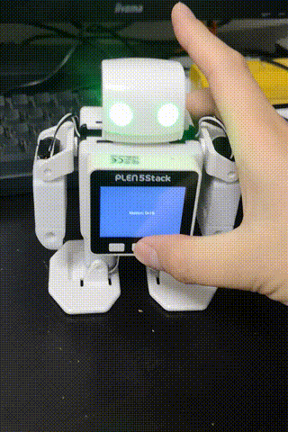

# Moddable PLEN5Stack

A module for moddable SDK to control [PLEN5Stack](https://plen.jp/plen5stack/)🤖



## Installation

* Install [Moddable SDK](https://github.com/Moddable-OpenSource/moddable)
* Copy `manifest-lib`.json and `plen5stack.js` into your project. Both should be in the same directory.
* Include manifest-lib.json

```json
// your manifest.json
{
  "include": ["YOUR_PROJECT/lib/plen5stack/manifest-lib.json"]
}
```

* Build with M5Stack target

```cmd
$ mcconfig -m -p esp32/m5stack
```

## Usage

See [main.js](./src/main.ts) for basic usage.
